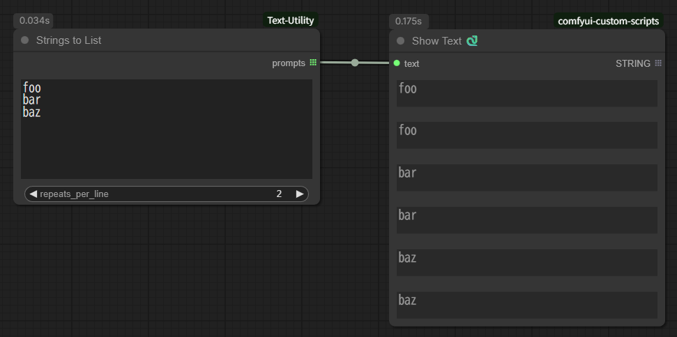

# ComfyUI-Text-Utility

[English][<a href="README_ja.md">日本語</a>]

Custom node to handle text.

Note: Custom nodes using wildcards internally call the wildcard processing of [ComfyUI-Impact-Pack](https://github.com/ltdrdata/ComfyUI-Impact-Pack). Therefore, ComfyUI-Impact-Pack must be installed beforehand.

For details on wildcards, refer to [ImpactWildcard](https://github.com/ltdrdata/ComfyUI-extension-tutorials/blob/Main/ComfyUI-Impact-Pack/tutorial/ImpactWildcard.md).

## Load Text File

Loads a specified file.

## Save Text File

Saves the text to the specified file.

If the directory does not exist, it is created.

If overwrite is set to True, overwrites the file.
If overwrite is False, no action is taken if the file exists.

## Remove Comments

Delete comment.Line comments and block comments are supported.

- line_comment : The string used to start a single line comment (default: //)
- block_comment_start : The string used to start a block comment (default: /*)
- block_comment_end : The string used to end a block comment (default: */)
- remove_linefeed : remove linefeed or not (default: No)
  - No : do not remove
  - All : remove all
  - Blank Lines Only : remove blank lines only
- normalize_commas : Normalize commas at word separators and remove extra commas (default: False)

## Strings from textbox

Extracts a single line from multiple lines of text entered in a textbox.

When executed in batch using batch count, it takes out one line at a time, incrementing from the start line each time it is executed.
You can use it like Webui's Prompts from file or textbox.

If you want to use wildcards, use "Prompts from textbox".

- text: Source text (multiple lines) to be extracted
- start: The line to start with
- mode: Whether to update each time start is processed (default: Continued)
  - Fixed : do not update
  - Continued : updated
- repeats_per_line: Number of repetitions per line
- counter: Internal management counter (will be ignored even if set)

## Strings to List

Splits the input text into lines and returns them as a list.

- text: Source text (multiple lines)
- repeats_per_line: Number of repetitions per line

## Prompts from textbox

"Strings from textbox" with wildcard support.

- wildcard_text: The source wildcard text (multiple lines) to be extracted
- seed: Seed to use for wildcard processing
- start: The line to start with
- mode: Whether to update each time start is processed (default: Fixed)
  - Fixed : do not update
  - Continued : updated
- repeats_per_line: Number of repetitions per line
- counter: Internal management counter (will be ignored even if set)

## Replace Variables

Replaces variables in the input text using definitions.

- Variable definition syntax: `$name="value"` (value must be enclosed in double quotes)
- Multiple variables can be defined.
- Variable usage syntax: `$name`
- Example input: `$animal="cat" $color="black" The $color $animal sleeps on the sofa.`
- Example output: `The black cat sleeps on the sofa.`

## Process Wildcard

This is a single-function node for expanding wildcards in Impact Pack. It processes wildcards within the input text using the specified seed and returns the result.

- wildcard_text: Wildcard text to expand (multiple lines allowed)
- seed: Seed used for wildcard processing

## Replace Variables and Process Wildcard (Loop)

Replaces variables and then expands wildcards, in that order, repeating the pair of operations `loop_count` times. Useful when variable values contain wildcards or when multi-step expansion is needed.

- text: Input text that may include variable definitions, variable references, and wildcard expressions
  - Variable definition: `$name="value"` (value must be in double quotes)
  - Variable reference: `$name`
  - Variable definitions are removed from the text before processing
- seed: Seed used for wildcard processing
- remove_linefeed: Whether to remove line breaks from the result
  - No: keep line breaks
  - All: remove all line breaks
  - Blank Lines Only: remove only blank lines
- normalize_commas: Normalize comma spacing and remove extra commas
- remove_undefined_variables: Remove any `$var` references that are not defined
- process_conditional_tags: Execute the same processing as the <a href="doc/ConditionalTagProcessor.md">Conditional Tag Processor</a> exactly once at the end.
- loop_count: Number of times to repeat “replace variables → process wildcards”

- Example input: `$adj="beautiful" $thing="__objects__" A $adj $thing`
- Example output: `A beautiful flower`

## Conditional Tag Processor
Adds or removes tags when conditions match.\
For details, see <a href="doc/ConditionalTagProcessor.md">Conditional Tag Processor</a>.

## Changelog

- V1.5.3 (2025-11-28)
  - Changed to import `ComfyUI-Impact-Pack` only when needed
- V1.5.2 (2025-11-28)
  - Added `Strings to List` node
- V1.5.1 (2025-10-01)
  - Fixed a bug in the `line_counter` output of the `Strings from textbox` node and the `Prompts from textbox` node
- V1.5.0 (2025-09-30)
  - Added `Conditional Tag Processor` node
  - Added `process_conditional_tags` option to `Replace Variables and Process Wildcard (Loop)` node
- V1.4.2 (2025-09-29)
  - Added `line_counter` and `total_counter` to the output of the `Strings from textbox` node and `Prompts from textbox` node
- V1.4.1 (2025-09-29)
  - Added `repeats_per_line` setting to `Strings from textbox` node and `Prompts from textbox` node
- V1.4.0 (2025-09-28)
  - Added `Process Wildcard` node 
  - Added `Replace Variables and Process Wildcard (Loop)` node
- v1.3.1 (2025-04-22)
  - Added `normalize_commas` option to `Remove Comments` node
- v1.3.0 (2025-04-22)
  - Add `Replace Variables` Node
- v1.2.0 (2025-04-06)
  - Add `Prompts from textbox` Node
- v1.1.0 (2025-04-05)
  - Add `Strings from textbox` Node
